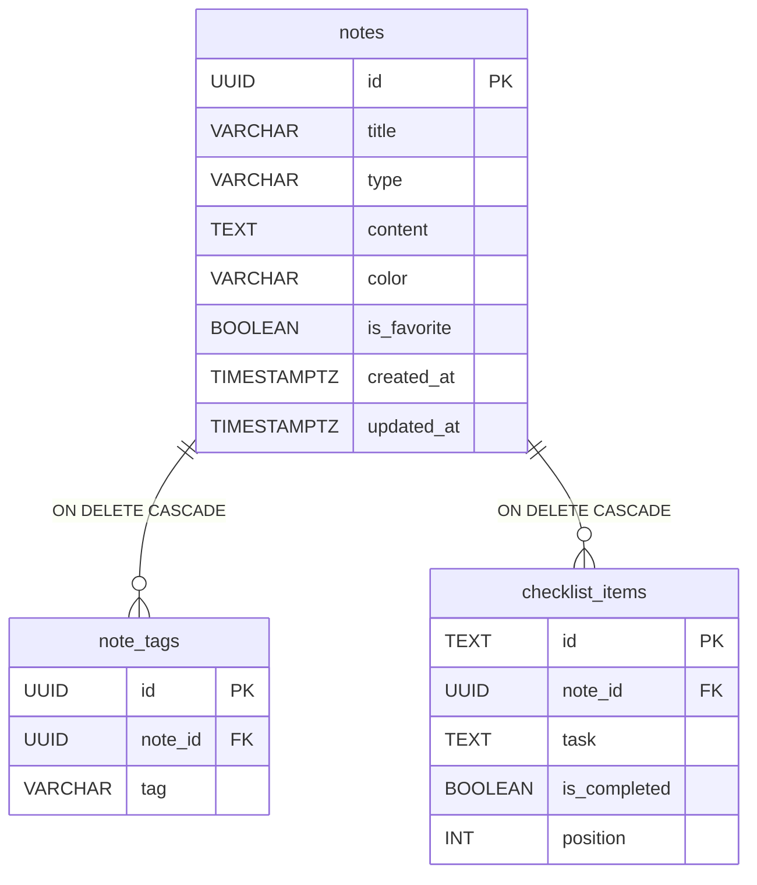

# API de notas (`/api/notes`)

Backend **Next.js** en `noteflow-api/`. Base URL local: `http://localhost:3000/api`.

**Autenticación obligatoria** en todas las rutas de notas:

```http
Authorization: Bearer <JWT o Firebase ID Token>
```

Las etiquetas (`note_tags`) y tareas (`checklist_items`) están vinculadas a `notes` con `ON DELETE CASCADE`.

Colección de peticiones para el cliente HTTP del IDE: `noteflow-api/requests/notes.http`.

---

## Arrancar el servidor

```bash
cd noteflow-api
npm run dev
```

---

## `GET /api/notes`

Lista todas las notas (sin expandir tags/items en la colección).

**Respuesta real — `200 OK`**

```json
[
  {
    "id": "45b23dff-e64b-4f19-bd3e-4b1c47fd032d",
    "title": "Mi primera nota",
    "content": "Hola",
    "type": "note",
    "color": null,
    "created_at": "2026-06-08T15:32:56.114Z",
    "updated_at": "2026-06-08T15:32:56.114Z",
    "is_favorite": false
  }
]
```

---

## `POST /api/notes`

Crea una nota. Acepta `tags` e `items` opcionales; se insertan en tablas hijas.

**Petición**

```json
{
  "title": "Checklist de prueba API",
  "type": "checklist",
  "content": "Tareas del sprint",
  "color": "#6366F1",
  "tags": ["backend", "api"],
  "items": [
    { "task": "Implementar GET por id", "is_completed": true },
    { "task": "Documentar respuestas", "is_completed": false }
  ]
}
```

**Respuesta real — `201 Created`**

```json
{
  "id": "2b7769d9-b779-4724-a3fc-b167b521808b",
  "title": "Checklist de prueba API",
  "content": "Tareas del sprint",
  "type": "checklist",
  "color": "#6366F1",
  "created_at": "2026-06-08T15:37:26.152Z",
  "updated_at": "2026-06-08T15:37:26.152Z",
  "is_favorite": false,
  "tags": ["api", "backend"],
  "items": [
    {
      "id": "5da680a8-c768-4299-ae78-b2ca081ef69e",
      "task": "Implementar GET por id",
      "is_completed": true
    },
    {
      "id": "2b01de9f-46d6-4c92-ab22-fa3c90bb5e4f",
      "task": "Documentar respuestas",
      "is_completed": false
    }
  ]
}
```

**Validación fallida — `400 Bad Request`**

```json
{
  "errors": [
    {
      "origin": "string",
      "code": "too_small",
      "minimum": 3,
      "inclusive": true,
      "path": ["title"],
      "message": "Too small: expected string to have >=3 characters"
    },
    {
      "code": "invalid_value",
      "values": ["note", "checklist", "idea"],
      "path": ["type"],
      "message": "Invalid option: expected one of \"note\"|\"checklist\"|\"idea\""
    }
  ]
}
```

---

## `GET /api/notes/:id`

Devuelve la nota con `tags` e `items` embebidos.

**Respuesta real — `200 OK`**

```json
{
  "id": "2b7769d9-b779-4724-a3fc-b167b521808b",
  "title": "Checklist de prueba API",
  "content": "Tareas del sprint",
  "type": "checklist",
  "color": "#6366F1",
  "created_at": "2026-06-08T15:37:26.152Z",
  "updated_at": "2026-06-08T15:37:26.152Z",
  "is_favorite": false,
  "tags": ["api", "backend"],
  "items": [
    {
      "id": "5da680a8-c768-4299-ae78-b2ca081ef69e",
      "task": "Implementar GET por id",
      "is_completed": true
    },
    {
      "id": "2b01de9f-46d6-4c92-ab22-fa3c90bb5e4f",
      "task": "Documentar respuestas",
      "is_completed": false
    }
  ]
}
```

**Nota inexistente — `404 Not Found`**

```json
{
  "error": "Nota no encontrada"
}
```

---

## `PATCH /api/notes/:id`

Actualización parcial. Si se envían `tags` o `items`, reemplazan por completo las filas hijas.

**Petición**

```json
{
  "title": "Checklist actualizada",
  "is_favorite": true,
  "tags": ["backend", "docs"],
  "items": [
    { "task": "Implementar GET por id", "is_completed": true },
    { "task": "Documentar respuestas", "is_completed": true }
  ]
}
```

**Respuesta real — `200 OK`**

```json
{
  "id": "2b7769d9-b779-4724-a3fc-b167b521808b",
  "title": "Checklist actualizada",
  "content": "Tareas del sprint",
  "type": "checklist",
  "color": "#6366F1",
  "created_at": "2026-06-08T15:37:26.152Z",
  "updated_at": "2026-06-08T15:37:29.711Z",
  "is_favorite": true,
  "tags": ["backend", "docs"],
  "items": [
    {
      "id": "f414fed4-cd44-4e9c-98cf-294d61472413",
      "task": "Implementar GET por id",
      "is_completed": true
    },
    {
      "id": "37ac9c83-ac30-4e4d-a5b9-ae14239bb9c6",
      "task": "Documentar respuestas",
      "is_completed": true
    }
  ]
}
```

---

## `DELETE /api/notes/:id`

Borra la nota. Gracias a `ON DELETE CASCADE`, desaparecen también sus filas en `note_tags` y `checklist_items`.

**Respuesta real — `204 No Content`**

Sin cuerpo en la respuesta.

Tras el borrado, `GET /api/notes/:id` devuelve:

```json
{
  "error": "Nota no encontrada"
}
```

con status `404`.

---

## Modelo relacional



---

## `GET /api/notes/:id/checklist-items`

Lista los items de checklist de una nota.

**Respuesta real — `200 OK`**

```json
[
  {
    "id": "c0e6d6c1-ef68-4902-b794-e4005146edee",
    "note_id": "edb2088c-9c22-4ac0-861a-c08b04053e6e",
    "task": "Primera tarea",
    "is_completed": false,
    "position": 0
  }
]
```

## `POST /api/notes/:id/checklist-items`

Añade un item a la checklist de la nota.

**Petición**

```json
{ "task": "Primera tarea" }
```

**Respuesta real — `201 Created`**

```json
{
  "id": "c0e6d6c1-ef68-4902-b794-e4005146edee",
  "note_id": "edb2088c-9c22-4ac0-861a-c08b04053e6e",
  "task": "Primera tarea",
  "is_completed": false,
  "position": 0
}
```

## `PATCH /api/checklist-items/:itemId`

Marca o desmarca un item. Sin cuerpo, alterna el valor actual; con `{ "is_completed": true|false }`, lo fija.

**Respuesta real (toggle) — `200 OK`**

```json
{
  "id": "c0e6d6c1-ef68-4902-b794-e4005146edee",
  "note_id": "edb2088c-9c22-4ac0-861a-c08b04053e6e",
  "task": "Primera tarea",
  "is_completed": true,
  "position": 0
}
```

## `DELETE /api/checklist-items/:itemId`

Elimina un item. Respuesta **`204 No Content`** sin body.

---

## Resumen de códigos de estado

| Método | Ruta | Éxito | Error frecuente |
|--------|------|-------|-----------------|
| GET | `/api/notes` | 200 | 500 |
| POST | `/api/notes` | 201 | 400, 500 |
| GET | `/api/notes/:id` | 200 | 404, 500 |
| PATCH | `/api/notes/:id` | 200 | 400, 404, 500 |
| DELETE | `/api/notes/:id` | 204 (sin body) | 404, 500 |
| GET | `/api/notes/:id/checklist-items` | 200 | 404, 500 |
| POST | `/api/notes/:id/checklist-items` | 201 | 400, 404, 500 |
| PATCH | `/api/checklist-items/:itemId` | 200 | 404, 500 |
| DELETE | `/api/checklist-items/:itemId` | 204 (sin body) | 404, 500 |
