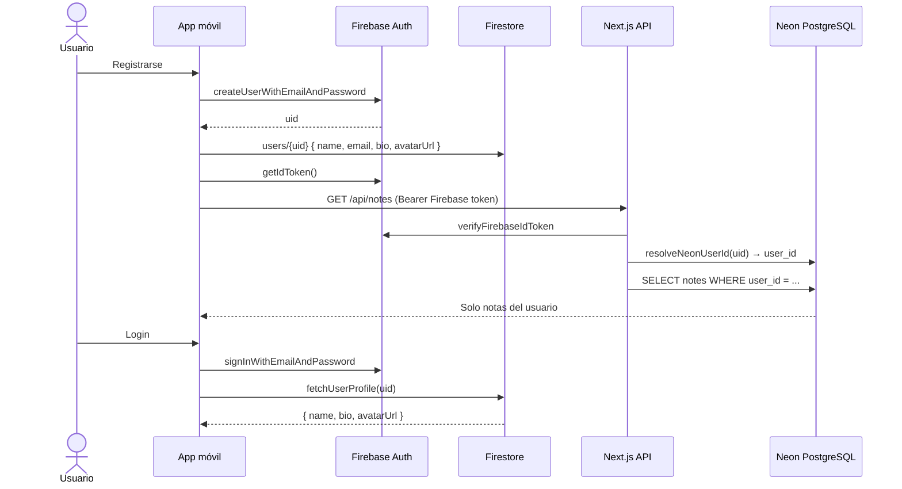

# Autenticación móvil con Firebase

NoteFlow en **iOS/Android** usa **Firebase Auth** para identidad y **Firestore** para el perfil extendido (nombre, biografía, foto). Las notas se guardan en **PostgreSQL (Neon)** vía la API, filtradas por usuario.

---

## Diagrama de flujo



---

## Setup Firebase

### 1. Consola Firebase

1. [console.firebase.google.com](https://console.firebase.google.com)
2. Proyecto: `noteflow2-18554` (o el tuyo)
3. **Authentication → Sign-in method → Email/Password** → Activar
4. **Firestore Database → Create database**

### 2. Reglas Firestore (desarrollo)

```javascript
rules_version = '2';
service cloud.firestore {
  match /databases/{database}/documents {
    match /users/{userId} {
      allow read, write: if request.auth != null && request.auth.uid == userId;
    }
  }
}
```

### 3. Archivos nativos

En la raíz del proyecto:

- `google-services.json` (Android)
- `GoogleService-Info.plist` (iOS)

Configurados en `app.json`:

```json
"plugins": [
  "@react-native-firebase/app",
  "@react-native-firebase/auth"
]
```

### 4. Development Build (obligatorio)

`@react-native-firebase` **no funciona en Expo Go**. Usa EAS:

```bash
npm install -g eas-cli
eas login
eas build --profile development --platform android
```

---

## Registro (Firebase + Firestore)

Implementado en `lib/firebaseAuth.ts`:

```typescript
const userCredential = await auth().createUserWithEmailAndPassword(email, password);
await firestore().collection("users").doc(userId).set({
  name,
  email,
  bio: "",
  avatarUrl: null,
  createdAt: firestore.FieldValue.serverTimestamp(),
});
```

Pantallas: `app/register.tsx`, `app/login.tsx`

---

## Protección de rutas

`app/_layout.tsx` escucha la sesión:

```typescript
auth().onAuthStateChanged(async (firebaseUser) => {
  if (firebaseUser) {
    const profile = await fetchUserProfile(firebaseUser.uid);
    await setSession(profile ?? mapFirebaseUser(firebaseUser));
  } else {
    await setSession(null);
  }
});
```

Si no hay usuario → redirige a `/login`.

---

## Notas por usuario (móvil → API → Neon)

1. Tras login, la app guarda el **Firebase ID Token**.
2. Cada petición a la API lleva `Authorization: Bearer <token>`.
3. `noteflow-api/lib/require-auth.ts` verifica el token Firebase.
4. `noteflow-api/lib/firebase-user.ts` enlaza `firebase_uid` con un usuario en Neon.
5. Las notas se filtran con `WHERE user_id = $1`.

Así **cada persona solo ve sus notas**, aunque compartan la misma base de datos.

---

## Perfil de usuario

| Campo | Firestore (móvil) | PostgreSQL (web) |
|-------|---------------------|------------------|
| name | `users/{uid}.name` | `users.name` |
| email | `users/{uid}.email` | `users.email` |
| bio | `users/{uid}.bio` | `users.bio` |
| avatarUrl | `users/{uid}.avatarUrl` | `users.avatar_url` |

Pantalla: `app/perfil.tsx` — editar biografía, foto, guardar, cerrar sesión.

---

## Web vs móvil

| | Web | Móvil |
|---|-----|-------|
| Auth | JWT (API) | Firebase Auth |
| Perfil | PostgreSQL | Firestore |
| Notas | PostgreSQL | PostgreSQL (vía token Firebase) |
| Imágenes | S3 + PostgreSQL | S3 + Firestore/PostgreSQL |

---

## Guion de demo para entrega

1. Instalar **Development Build** (APK) en el móvil.
2. Configurar `EXPO_PUBLIC_API_URL` apuntando a la API (local o Vercel).
3. **Registrar** usuario A → crear nota → cerrar sesión.
4. **Registrar** usuario B → comprobar que **no** ve la nota de A.
5. **Perfil** → biografía + foto → guardar → recargar app.
6. Adjuntar imagen a una nota → ver con `RemoteImage`.

---

## Archivos clave

| Archivo | Rol |
|---------|-----|
| `lib/firebaseAuth.ts` | Auth, registro, perfil Firestore |
| `store/authStore.ts` | Estado global de sesión |
| `app/_layout.tsx` | Guard de rutas |
| `noteflow-api/lib/firebase-user.ts` | Puente Firebase → Neon |
| `noteflow-api/lib/require-auth.ts` | JWT o Firebase token |

Imágenes S3: [`configuracion-aws-s3.md`](./configuracion-aws-s3.md)
