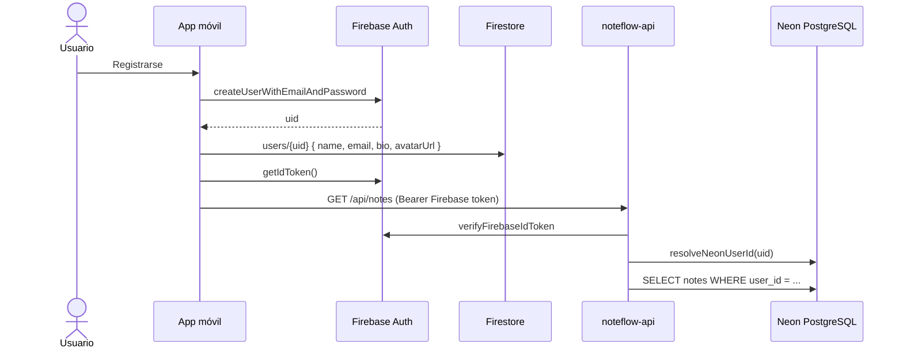

# Autenticación móvil con Firebase

NoteFlow en **iOS/Android** usa **Firebase Auth** para identidad y **Firestore** para el perfil extendido (nombre, biografía, foto). Las notas se guardan en **PostgreSQL (Neon)** vía la API, filtradas por usuario.

En **web**, la autenticación es **JWT** contra la API (sin Firebase).

---

## Diagrama de flujo (móvil)



---

## Web vs móvil

| | Web | Móvil nativo |
|---|-----|--------------|
| Auth | JWT (`POST /api/auth/login`) | Firebase Auth |
| Token | `sessionStorage` + Secure Store | Firebase ID Token |
| Perfil (bio, avatar) | PostgreSQL `users` | Firestore `users/{uid}` |
| Notas | PostgreSQL vía API | PostgreSQL vía API (token Firebase) |
| Imágenes | S3 + `/api/media` + PostgreSQL | S3 + Firestore/PostgreSQL |

---

## Setup Firebase

### 1. Consola Firebase

1. [console.firebase.google.com](https://console.firebase.google.com)
2. Proyecto: `noteflow2-18554` (o el tuyo)
3. **Authentication → Email/Password** → Activar
4. **Firestore Database** → Crear

### 2. Reglas Firestore (desarrollo)

```javascript
rules_version = '2';
service cloud.firestore {
  match /databases/{database}/documents {
    match /users/{userId} {
      allow read, write: if request.auth != null && request.auth.uid == userId;
    }
  }
}
```

### 3. Archivos nativos

En la raíz: `google-services.json`, `GoogleService-Info.plist`.

Plugins en `app.json`: `@react-native-firebase/app`, `@react-native-firebase/auth`.

### 4. Development Build

`@react-native-firebase` **no funciona en Expo Go**. Usa EAS Build o `npx expo run:android`.

---

## Perfil de usuario

| Campo | Firestore (móvil) | PostgreSQL (web) |
|-------|---------------------|------------------|
| name | `users/{uid}.name` | `users.name` |
| email | `users/{uid}.email` | `users.email` |
| bio | `users/{uid}.bio` | `users.bio` |
| avatarUrl | `users/{uid}.avatarUrl` | `users.avatar_url` |

Pantalla: `app/perfil.tsx`

**Web:** elegir foto → **Guardar cambios** → `PATCH /api/auth/me`.

**Móvil:** elegir foto → **Guardar cambios** → `updateUserProfile()` en Firestore.

La URL del avatar apunta a `/api/media/avatars/...` (ver [`flujo-subida-imagenes-s3.md`](./flujo-subida-imagenes-s3.md)).

---

## Notas por usuario (móvil → API → Neon)

1. Tras login, la app obtiene el **Firebase ID Token**.
2. Peticiones API: `Authorization: Bearer <token>`.
3. `noteflow-api/lib/require-auth.ts` verifica JWT o token Firebase.
4. `noteflow-api/lib/firebase-user.ts` enlaza `firebase_uid` con usuario Neon.
5. Notas filtradas: `WHERE user_id = $1`.

---

## Protección de rutas

`app/_layout.tsx` — en nativo escucha `auth().onAuthStateChanged`; en web usa `initWeb()` del store (JWT + `GET /api/auth/me`).

---

## Variables de entorno

```env
EXPO_PUBLIC_API_URL=http://TU-IP:3000/api    # o URL Vercel de la API
FIREBASE_PROJECT_ID=noteflow2-18554           # API verifica tokens móvil
```

---

## Guion de demo

1. Development Build en móvil + API accesible (local o Vercel).
2. Registrar usuario A → crear nota → logout.
3. Registrar usuario B → no debe ver notas de A.
4. Perfil → foto + bio → **Guardar cambios** → logout → login → foto visible.
5. Adjuntar imagen a nota.

---

## Archivos clave

| Archivo | Rol |
|---------|-----|
| `lib/firebaseAuth.ts` | Auth, registro, perfil Firestore |
| `store/authStore.ts` | Sesión global (web + nativo) |
| `app/_layout.tsx` | Guard de rutas |
| `noteflow-api/lib/firebase-user.ts` | Puente Firebase → Neon |
| `noteflow-api/lib/require-auth.ts` | JWT o Firebase token |
| `noteflow-api/lib/firebase-admin.ts` | Verificación ID token |

Imágenes: [`configuracion-aws-s3.md`](./configuracion-aws-s3.md)
