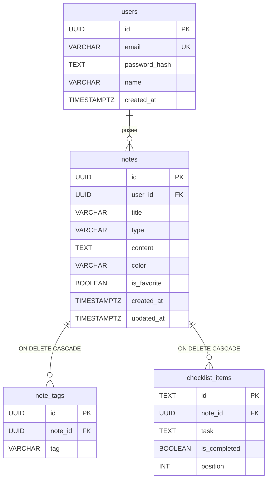

# Backend: teoría básica

Este documento resume los conceptos que sustentan el backend de Noteflow y cualquier API REST moderna.

---

## Arquitectura de Noteflow

```
┌─────────────────────────────────────────────────────────────────┐
│                        CLIENTE (Expo)                           │
│  React Native · Zustand · Secure Store / sessionStorage         │
└────────────────────────────┬────────────────────────────────────┘
                             │ HTTPS + JSON
                             │ Authorization: Bearer <token>
                             ▼
┌─────────────────────────────────────────────────────────────────┐
│                   API (Next.js · noteflow-api/)                   │
│  JWT / Firebase · Zod · sql.query() · /api/media (proxy)        │
│  Despliegue: Vercel (proyecto separado del frontend)            │
└───────────────┬─────────────────────────────┬───────────────────┘
                │ SQL                         │ S3 API (Put/Get)
                ▼                             ▼
┌───────────────────────────┐   ┌───────────────────────────────┐
│  Neon · PostgreSQL          │   │  AWS S3 (o disco local dev)   │
│  users · notes · tags · …   │   │  avatars/ · notes/            │
└───────────────────────────┘   └───────────────────────────────┘
```

| Capa | Tecnología | Responsabilidad |
|------|------------|-----------------|
| Cliente | Expo Router, `lib/api.ts`, `lib/mediaUrl.ts` | UI, token, URLs de imagen |
| API | Next.js App Router | REST, auth, subida, proxy `/api/media` |
| Datos | Neon PostgreSQL | Usuarios, notas, adjuntos (URLs) |
| Archivos | AWS S3 | Bytes de imágenes (bucket puede ser privado) |

Flujo con autenticación (web):

1. `POST /api/auth/login` → JWT + `{ user: { bio, avatarUrl, ... } }`.
2. Token en **expo-secure-store** (móvil) o almacenamiento web.
3. Peticiones a `/api/notes`, `/api/auth/me`, `/api/uploads/direct` con `Authorization: Bearer`.
4. Imágenes: subida → URL `/api/media/...` → proxy S3 en el servidor.

---

## Patrón cliente-servidor

En el patrón **cliente-servidor**, dos roles colaboran pero están separados:

| Rol | Qué hace | En Noteflow |
|-----|----------|-------------|
| **Cliente** | Interfaz con la que interactúa el usuario; pide datos y envía acciones | App Expo (web, móvil) |
| **Servidor** | Recibe peticiones, aplica reglas de negocio, accede a datos y responde | API Next.js en `noteflow-api/` |

Flujo típico:

1. El usuario pulsa "guardar nota" en la app.
2. El **cliente** envía una petición HTTP al servidor (`POST /api/notes`).
3. El **servidor** valida los datos, los guarda en la base de datos (Neon/PostgreSQL) y devuelve la nota creada.
4. El **cliente** actualiza la pantalla con la respuesta.

Ventajas de separar cliente y servidor:

- **Una sola fuente de verdad** para los datos (la base de datos en el servidor).
- **Varios clientes** pueden usar la misma API (web, iOS, Android).
- **Seguridad**: credenciales y connection strings viven solo en el servidor, nunca en la app del usuario.

---

## Qué es una API REST

**REST** (Representational State Transfer) es un estilo de diseño para APIs que usan **HTTP** y tratan los recursos como URLs.

Un **recurso** es una entidad del dominio: una nota, una idea, una checklist.

Ejemplos en Noteflow:

| Recurso | URL base |
|---------|----------|
| Notas | `/api/notes` |
| Ideas | `/api/ideas` |
| Checklists | `/api/checklists` |

Principios clave de REST:

- **Sin estado en el servidor** entre peticiones: cada request lleva la información necesaria (token, cuerpo JSON, etc.).
- **Recursos identificados por URL**: `/api/notes/n1` es la nota con id `n1`.
- **Representaciones** (normalmente JSON): el cliente y el servidor intercambian objetos serializados, no tablas crudas de la base de datos.
- **Métodos HTTP estándar** para las operaciones (ver siguiente sección).

Una API REST **no es** un protocolo distinto a HTTP: es una convención sobre cómo organizar rutas, métodos y respuestas encima de HTTP.

---

## Métodos HTTP

Cada método indica la **intención** de la petición:

| Método | Uso habitual | Ejemplo Noteflow |
|--------|--------------|------------------|
| **GET** | Leer datos; no modifica nada | `GET /api/notes` → lista de notas |
| **POST** | Crear un recurso nuevo | `POST /api/notes` + `{ "title": "...", "content": "..." }` |
| **PUT** | Reemplazar o actualizar un recurso completo | `PUT /api/notes/n1` + cuerpo con todos los campos |
| **PATCH** | Actualización parcial | `PATCH /api/notes/n1/favorite` → alternar favorito |
| **DELETE** | Eliminar un recurso | `DELETE /api/notes/n1` |

Regla práctica:

- **GET** y **DELETE** suelen ir sin cuerpo (body).
- **POST**, **PUT** y **PATCH** llevan JSON en el cuerpo cuando hace falta enviar datos.

---

## Códigos de estado HTTP

El servidor responde con un **código numérico** que resume el resultado. El cliente lo usa para decidir qué hacer (mostrar error, redirigir, etc.).

### 2xx — Éxito

| Código | Significado | Cuándo usarlo |
|--------|-------------|---------------|
| **200 OK** | Petición correcta | GET, PUT, PATCH con cuerpo de respuesta |
| **201 Created** | Recurso creado | POST que crea una nota nueva |
| **204 No Content** | Éxito sin cuerpo | DELETE completado |

### 4xx — Error del cliente

| Código | Significado | Cuándo usarlo |
|--------|-------------|---------------|
| **400 Bad Request** | Datos inválidos | JSON mal formado, validación fallida |
| **401 Unauthorized** | No autenticado | Falta login o token |
| **403 Forbidden** | Sin permiso | Usuario válido pero sin acceso al recurso |
| **404 Not Found** | Recurso inexistente | `GET /api/notes/id-inexistente` |

### 5xx — Error del servidor

| Código | Significado | Cuándo usarlo |
|--------|-------------|---------------|
| **500 Internal Server Error** | Fallo inesperado | Bug, caída de base de datos, excepción no controlada |

Ejemplo de respuesta de error (JSON):

```json
{
  "error": "Note not found"
}
```

---

## Modelo de datos (diagrama entidad-relación)

Noteflow persiste datos en **Neon (PostgreSQL)**. El esquema está en `server/sql/schema.sql`.

El modelo de producción unifica notas, ideas y checklists en la tabla `notes` (campo `type`), con tablas hijas para etiquetas e items.

### Diagrama ER



### Campo `type` en `notes`

| Valor | Significado en la app |
|-------|----------------------|
| `note` | Nota de texto (`content`) |
| `idea` | Idea (`content` = descripción, `color`, `tags` en `note_tags`) |
| `checklist` | Checklist (`checklist_items` como tareas) |

### Relaciones

| Relación | Tipo | Comportamiento |
|----------|------|----------------|
| `users` → `notes` | 1:N | Cada nota pertenece a un usuario (`user_id`) |
| `notes` → `note_tags` | 1:N | CASCADE al borrar la nota |
| `notes` → `checklist_items` | 1:N | CASCADE al borrar la nota |

---

## INNER JOIN y LEFT JOIN

Cuando dos tablas están relacionadas por clave foránea (p. ej. `notes` y `checklist_items`), un **JOIN** combina filas de ambas en una sola consulta.

### INNER JOIN

Devuelve **solo** las filas donde hay coincidencia en **ambas** tablas.

```sql
SELECT n.title, ci.task
FROM notes n
INNER JOIN checklist_items ci ON n.id = ci.note_id;
```

| Cuándo usarlo | Ejemplo en Noteflow |
|---------------|---------------------|
| Solo te interesan notas que **sí tienen** items | Listar checklists con al menos una tarea pendiente |
| Quieres excluir registros “huérfanos” del lado izquierdo | Informe de tareas completadas (sin notas vacías) |

Si una nota no tiene items, **no aparece** en el resultado.

### LEFT JOIN

Devuelve **todas** las filas de la tabla izquierda y las coincidentes de la derecha. Si no hay coincidencia, las columnas de la derecha valen **NULL**.

```sql
SELECT n.title, ci.task
FROM notes n
LEFT JOIN checklist_items ci ON n.id = ci.note_id;
```

| Cuándo usarlo | Ejemplo en Noteflow |
|---------------|---------------------|
| Quieres **todas** las notas, tengan o no items | Dashboard principal con notas vacías y con tareas |
| Vas a agregar datos con `json_agg` o `COUNT` | Una fila por nota con `items: []` en lugar de omitirla |

Una nota sin items genera una fila con `ci.task = NULL`. Por eso, al agregar con `json_agg`, se usa `FILTER (WHERE ci.id IS NOT NULL)` para no incluir `null` en el array.

### Comparación rápida

| Aspecto | INNER JOIN | LEFT JOIN |
|---------|------------|-----------|
| Notas sin items | Excluidas | Incluidas |
| Notas con 3 items | 3 filas (una por item) | 3 filas (una por item) |
| Uso típico | Filtros estrictos | Listados completos + agregación |

La consulta completa con `json_agg` para notas + items + tags está en `server/sql/queries.sql`.

---

## Conexión a la base de datos (`lib/db.ts`)

El módulo `lib/db.ts` usa **Neon** (PostgreSQL serverless) con la variable de entorno `DATABASE_URL` definida en `.env.local` (nunca en el repositorio).

La función `query()` ejecuta SQL parametrizado y devuelve filas tipadas. El servidor es el único componente que debe importar este módulo; la app cliente solo habla con la API REST.

---

## Resumen

```
[ App Expo ]  --HTTP+JWT-->  [ Next.js API ]  --SQL-->  [ Neon PostgreSQL ]
   cliente                         servidor                  datos
```

- **Arquitectura**: cliente Expo → API Next.js en Vercel → Neon.
- **REST**: recursos + URLs + JSON + métodos HTTP.
- **SQL**: consultas parametrizadas; JOINs para agregar datos relacionados.
- **Auth**: JWT en cabecera `Authorization`; cada usuario solo ve sus notas.
