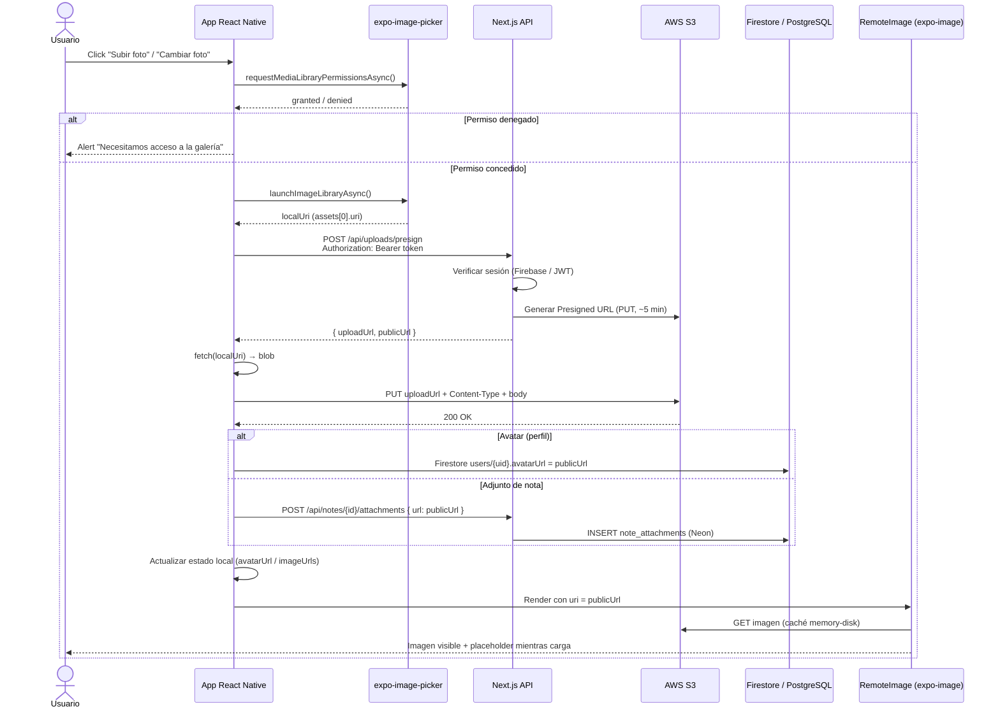

# Flujo de subida y visualización de imágenes (S3)

Este documento describe el recorrido de un archivo desde que el usuario pulsa **«Subir foto»** / **«Cambiar foto de perfil»** hasta que la imagen aparece en pantalla consumiendo la URL pública de AWS S3.

---

## Diagrama de flujo



---

## Vista simplificada (capas)

```
[ Usuario ]
     │
     ▼ Click "Subir foto"
[ expo-image-picker ] ──► URI local (file://...)
     │
     ▼
[ lib/s3Upload.ts · uploadToS3 / uploadToAWS ]
     │  1. POST presign (backend autenticado)
     │  2. fetch(uri) → Blob
     │  3. PUT → S3 Presigned URL
     ▼
[ AWS S3 ] ──► almacena bytes del archivo
     │
     ▼ publicUrl (https://bucket.s3.../avatars/uid/uuid.jpg)
[ Base de datos ] ──► solo guarda la URL (no el archivo)
     │   • Avatar  → Firestore `users/{uid}.avatarUrl`
     │   • Nota    → PostgreSQL `note_attachments.url`
     ▼
[ components/RemoteImage.tsx ]
     │  expo-image + cachePolicy memory-disk + placeholder
     ▼
[ Pantalla ] ──► usuario ve la imagen
```

---

## Código de referencia en el repo

### 1. Subida directa a S3 (`lib/uploadToAWS.ts`)

Equivalente al snippet del curso:

```typescript
// 1. Obtener URL firmada desde el backend + subir a S3
const publicUrl = await uploadToAWS(localUri, {
  folder: "avatars",
  fileName: "avatar.jpg",
  contentType: "image/jpeg",
});

// 2. Avatar: actualizar Firestore (también disponible como uploadAvatarToAWS)
await updateUserAvatarUrl(userId, publicUrl);
```

Implementación interna (`lib/s3Upload.ts`):

1. `POST /api/uploads/presign` con token de sesión.
2. `fetch(localUri)` → `blob`.
3. `fetch(uploadUrl, { method: "PUT", body: blob, headers: { Content-Type } })`.

### 2. Renderizado remoto con caché (`components/RemoteImage.tsx`)

```tsx
<RemoteImage
  uri={userProfile.avatarUrl}
  style={{ width: 100, height: 100, borderRadius: 50 }}
/>
```

Usa `expo-image` con:

- `cachePolicy="memory-disk"` — caché en memoria y disco.
- `transition={200}` — fundido al terminar la descarga.
- `ActivityIndicator` — placeholder mientras la red trae el archivo desde AWS.

### 3. Pantallas

| Pantalla | Archivo | Acción |
|----------|---------|--------|
| Perfil | `app/perfil.tsx` | Cambiar foto → Firestore |
| Nota | `app/nota/[id].tsx` | Adjuntar → PostgreSQL |

---

## Endpoints del backend

| Método | Ruta | Función |
|--------|------|---------|
| `POST` | `/api/uploads/presign` | Usuario autenticado → Presigned URL |
| `POST` | `/api/notes/{id}/attachments` | Guardar URL del adjunto en Neon |
| `GET` | `/api/notes/{id}/attachments` | Listar URLs de adjuntos |

---

## Requisitos

1. **AWS S3** configurado en `.env.local` (`AWS_ACCESS_KEY_ID`, `AWS_SECRET_ACCESS_KEY`, `AWS_S3_BUCKET`, …).
2. **API en marcha:** `npm run api`.
3. **Migración:** `npm run db:migrate` (tabla `note_attachments`).
4. **Sesión activa** — el presign exige `Authorization: Bearer <token>`.

---

## Seguridad

- Las credenciales de AWS **nunca** van en la app móvil.
- La app solo recibe una **URL temporal firmada** (Presigned URL) válida unos minutos.
- El backend comprueba que el usuario está logueado antes de generar la URL.
- En S3 las claves incluyen el `userId`: `avatars/{userId}/…`, `notes/{userId}/…`.
