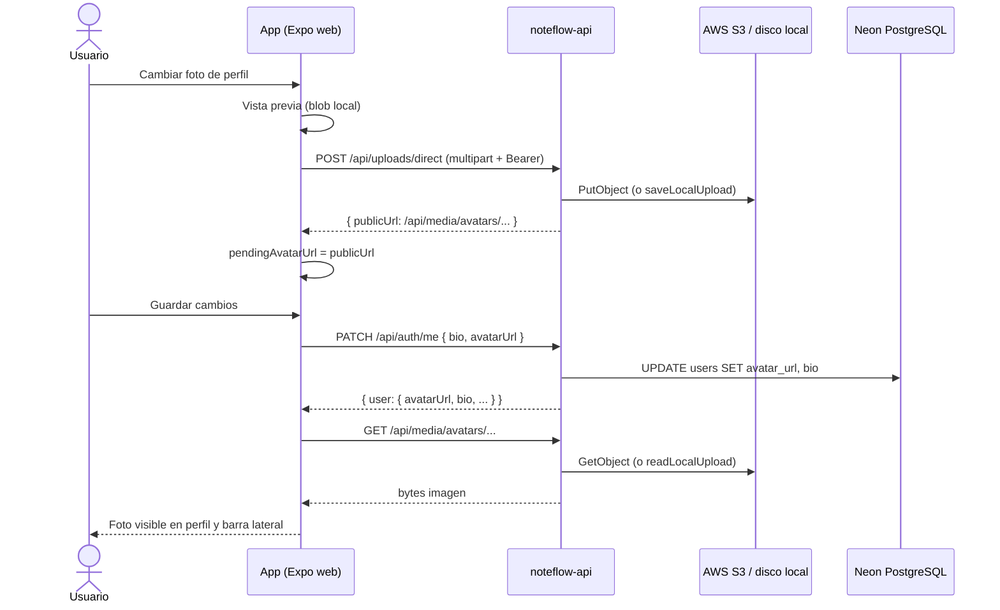
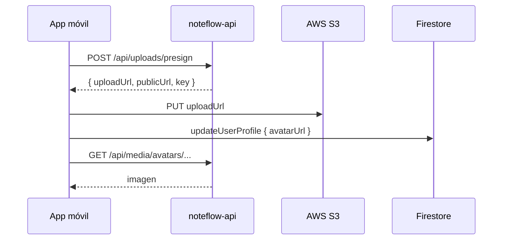

# Flujo de subida y visualización de imágenes

Recorrido completo desde que el usuario elige una foto hasta que aparece en pantalla (perfil, notas, barra lateral).

---

## Diagrama (web)



---

## Diagrama (móvil nativo)



---

## Capas simplificadas

```
[ Usuario ]
     │
     ▼ Elegir imagen
[ ImageAttachButton + lib/s3Upload.ts ]
     │  Web:  POST /api/uploads/direct
     │  Móvil: POST /api/uploads/presign → PUT S3
     ▼
[ Almacenamiento ]  S3 (prod) o noteflow-api/public/uploads/ (dev sin AWS)
     │
     ▼ publicUrl = https://API/api/media/avatars/{userId}/{uuid}-file.jpg
[ Base de datos ]
     │  Web avatar  → PostgreSQL users.avatar_url
     │  Web notas   → PostgreSQL note_attachments.url + content JSON
     │  Móvil avatar → Firestore users/{uid}.avatarUrl
     ▼
[ lib/mediaUrl.ts → resolveMediaUrl() ]
     ▼
[ RemoteImage / editor HTML ]
     ▼
[ Pantalla ]
```

---

## Perfil (web)

Pantalla: `app/perfil.tsx`

1. Usuario elige foto → subida inmediata a S3/local (aún **no** persiste en BD).
2. Usuario edita biografía (opcional).
3. **Guardar cambios** → `PATCH /api/auth/me` con `{ bio, avatarUrl }`.
4. `setSession` actualiza Zustand + `sessionStorage`.
5. Tras logout/login, `POST /api/auth/login` devuelve `user.avatarUrl`.

Avatar en barra lateral: `components/ProfileNavButton.tsx` (sin spinner de carga).

---

## Notas con imágenes (web)

- Editor: `components/NoteRichEditor/NoteRichEditor.web.tsx`
- HTML/imágenes: `utils/noteDocumentHtml.ts`
- Tras subir imagen en el editor, `onAutoPersist` guarda el contenido de la nota.

---

## Endpoints

| Método | Ruta | Función |
|--------|------|---------|
| `POST` | `/api/uploads/direct` | Subida server-side (web/Vercel) |
| `POST` | `/api/uploads/presign` | URL firmada (móvil) |
| `PUT` | `/api/uploads/local?key=...` | Almacenamiento local (dev) |
| `GET` | `/api/media/[...path]` | Proxy de imagen (S3 o disco) |
| `PATCH` | `/api/auth/me` | Guardar `avatarUrl` y `bio` |
| `POST` | `/api/notes/{id}/attachments` | Adjunto de nota en Neon |

---

## Archivos clave

| Archivo | Rol |
|---------|-----|
| `lib/s3Upload.ts` | Cliente de subida |
| `lib/mediaUrl.ts` | `resolveMediaUrl()` para `` / expo-image |
| `noteflow-api/lib/media-url.ts` | `buildPublicMediaUrl()` en servidor |
| `components/RemoteImage.tsx` | Imagen con caché; props `showLoading` |
| `components/ImageAttachButton.tsx` | Botón elegir + subir |
| `app/perfil.tsx` | Flujo bio + avatar |

---

## Requisitos

1. API en marcha: `npm run api`
2. Sesión activa (`Authorization: Bearer`)
3. En Vercel: variables `AWS_*` en proyecto **API**
4. Migración: `npm run db:migrate` (columna `users.avatar_url`, `users.bio`)

Configuración S3: [`configuracion-aws-s3.md`](./configuracion-aws-s3.md)
